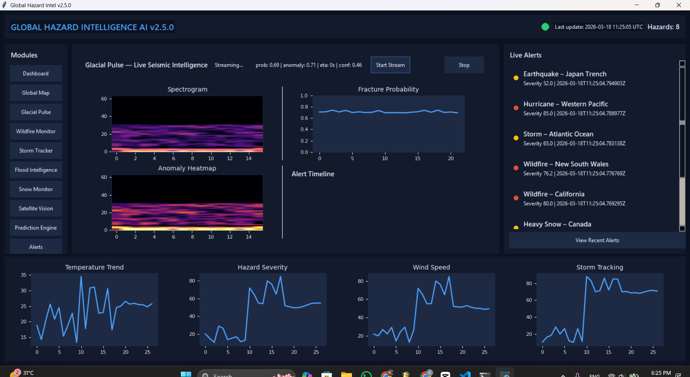
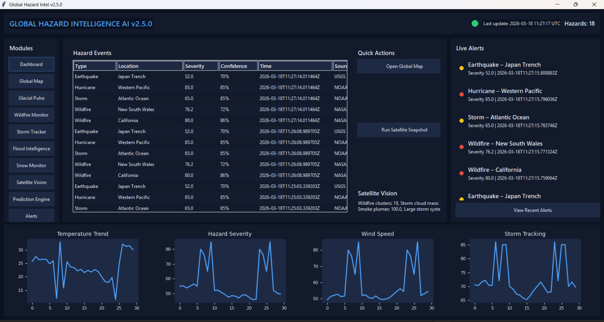
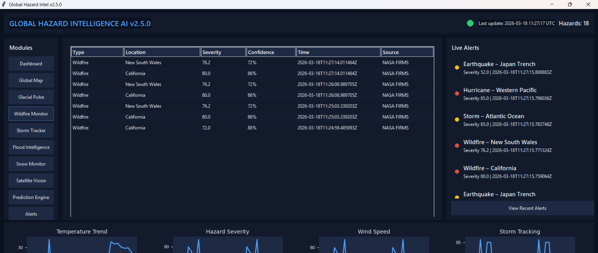
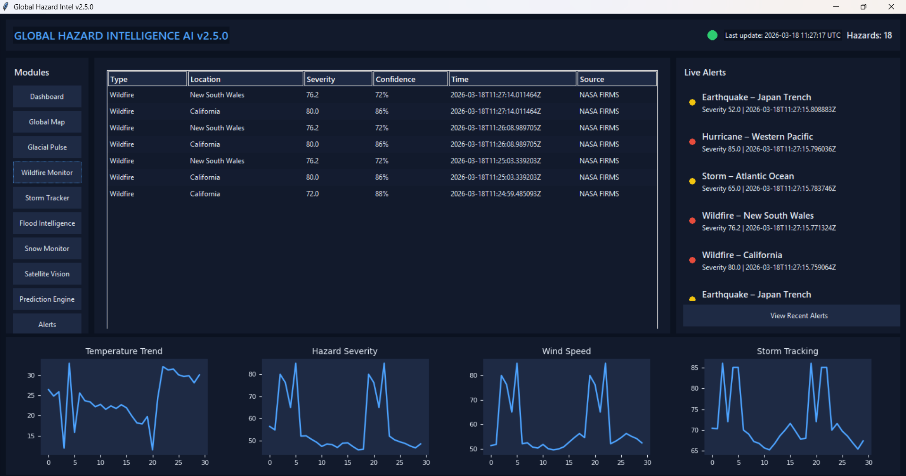
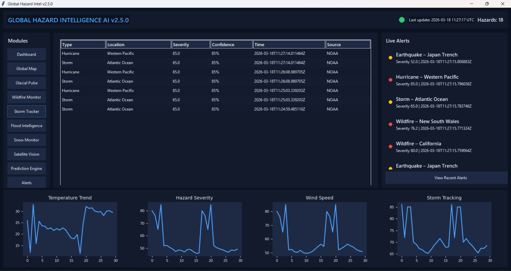
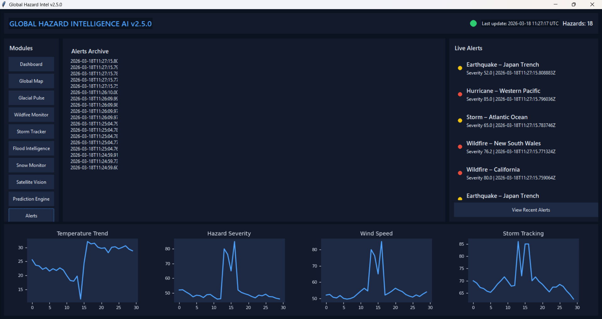

# Global Hazard Intel v2.5

Global Hazard Intel is a modular hazard intelligence platform that fuses environmental data, ML signals, and real-time monitoring. Version 2.5 introduces **Glacial Pulse**, a production-grade seismic audio pipeline to predict early-stage ice shelf fractures.

## Highlights (v2.5)
- Glacial Pulse seismic ML module for ice shelf fracture prediction
- Dual-path CNN + Transformer fusion with multi-head outputs
- Real-time streaming inference with integrated alerting
- Unsupervised autoencoder for anomaly scoring
- Seasonal baseline learning for glacier stress cycles
- FDSN API fetch utility for real seismic waveforms
- Research-grade visualization panel in the main dashboard

## Quick Start
```bash
python main.py
```

## Glacial Pulse
### Training (synthetic or local data)
```bash
python -m glacial_pulse.train.train_model --data-dir glacial_pulse/data --epochs 5
```

### Training with live FDSN seismic data
```bash
python -m glacial_pulse.train.train_model --fetch-fdsn --epochs 5
```

Default FDSN settings:
```
Base URL: https://service.earthscope.org/fdsnws/dataselect/1/
Network: IU
Station: PMSA
Channel: BH?
```

Note: FDSN waveforms are unlabeled. The dataset applies a low-frequency anomaly heuristic to create pseudo-labels for training.

### Real-time inference demo
```bash
python -m glacial_pulse.infer.real_time_infer --steps 8
```

### API server
```bash
python -m glacial_pulse.api.server --port 8084
```

Example request:
```json
{
  "audio_path": "path/to/window.wav",
  "temperature": -18.5
}
```

## Model Architecture
- CNN encoder for spatial spectrogram features
- Transformer encoder for temporal dynamics
- Fusion layer with three output heads
- Heads: fracture probability, time-to-fracture, confidence

## Alert Logic
- Trigger when `fracture_prob > 0.8` AND anomaly score is high
- Emits a hazard event and alert in the Global Hazard Intel stream

## Visualization Panel
- Live spectrogram viewer
- Fracture probability timeline
- Anomaly heatmap
- Alert timeline

## Screenshots
**Glacial Pulse — Live Seismic Intelligence**  


**Dashboard Overview**  


**Wildfire Monitor**  


**Wildfire Monitor (Alternate View)**  


**Storm Tracker**  


**Alerts Archive**  


## Repository Structure
```
glacial_pulse/
  data/
  preprocessing/
  features/
  models/
  train/
  infer/
  alerts/
  visualization/
  api/
```

## Requirements
- Python 3.10+
- torch
- numpy
- matplotlib
- scikit-learn
- obspy (required for `.mseed` files and FDSN API downloads)

## Troubleshooting
- If FDSN requests time out, reduce the time window or increase `--fdsn-timeout-sec`.
- If `.mseed` loading fails, ensure `obspy` is installed.

## License
This software is proprietary and requires a paid license for use, distribution, or modification.

Purchase: www.bgcode.tech  
Contact: contact@bgcode.tech, brian.gill@bgcode.tech

## Contact
- contact@bgcode.tech
- brian.gill@bgcode.tech
